<h3><code>suyashx1@github ~ $ whoami</code></h3>

<table>
  <tr>
    <td valign="top"></td>
    <td valign="top"></td>
  </tr>
</table>

 
 

<h3><code>suyashx1@github ~ $ ./contributions.sh</code></h3>

 
 

<h3><code>suyashx1@github ~ $ ./links.sh</code></h3>

<b>Computer Science & Engineering Student &bull; Robotics &bull; AI &amp; Automation</b>

 

